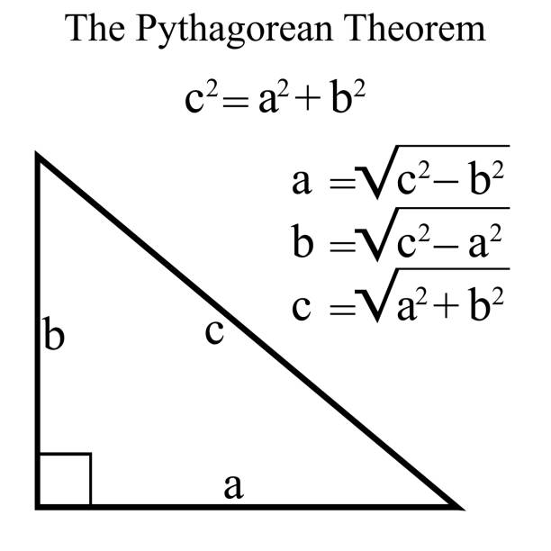

# tsp-osm-umd
Problema del agente viajero resuelto dibujado en Open Street Map. Electiva de geolocalización Uniminuto.

## Datos iniciales
El archivo input_data.json contiene la lista de las ciudades ejemplo con las cuales se va a desarrollar el ejercicio.
```json
{
  "ciudades": [ //Arreglo de ciudades
    {
      "nombre": "Bogotá", //Nombre de la ciudad
      "altura": 2640, //Altura de la ciudad, en metros, con respecto al nivel del mar
      "longitud": -74.0703, //Longitud
      "latitud": 4.6483, //Latitud
      "demora": 30 //Demora promedio, en minutos, en el aeropuerto principal de la ciudad
    }
    ...
  ]
}
```

## Conceptos
- Latitud(ϕ): Se representa con la letra griega Phi(ϕ).
- Longitud(λ): Se representa con la letra griega Lambda(λ).

## Cálculos a usar
Para realizar el ejercicio se va a realizar el uso de varias formulas, ecuaciones y cálculos dependiendo del paso a ejecutar.

### Fórmula del Haversine
Se usara la formula de Haversine para calcular la distancia entre dos puntos de la tierra, a partir de la latitud y longitud de cada uno.


### Teorema de Pitágoras
Se usara el teorema de Pitágoras para complementar el calculo de la distancia entre dos puntos, hallando la hipotenusa. Esto debido a las diferentes alturas que presentan las ciudades.
Se toma como punto de referencia la ciudad con la altitud menor y en base a esta, se calcula la distancia real teniendo en cuenta la altura y la distancia plana por la **Fórmula del Haversine**.


